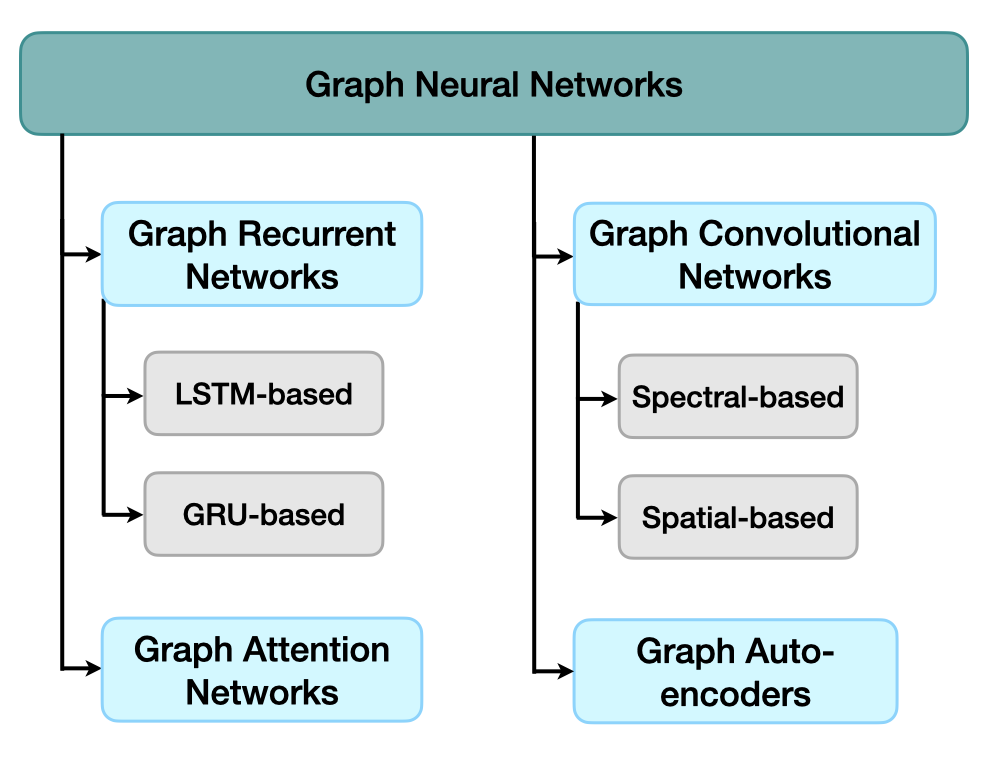

# Graph Neural Networks (GNNs) for Graph Summarization
Here we provide more details about the papers we have cited in each section of the survey (Submitted for the IJCAI Conferece 2023). 

We categorized the state of the art into four groups: Graph Recurrent Networks (GRNs), Graph Convolutional Networks (GCNs), Graph Auto-encoders (GAEs), and Graph Attention Networks (GATs).

## Graph Recurrent Neural Networks (GRNs)
### LSTM-based Approaches
|  Title   | Year| Venue (Rank)| Authors | Link |
|  ----    | ----  | ----   | ----   ----| 
|Improving Question Answering over Knowledge Graphs Using Graph Summarization| 2021 | ICONIP (A) |Li et al. | [link](https://dl.acm.org/doi/abs/10.1007/978-3-030-92273-3_40)|
| Learning Graph Representations with Recurrent Neural Network Autoencoders | 2018 | KDD (A*) | Taheri et al. | [link](https://www.kdd.org/kdd2018/files/deep-learning-day/DLDay18_paper_27.pdf)|
|Dynamic representation learning via recurrent graph neural networks | 2022 | IEEE Transactions on Systems, Man, and Cybernetics: Systems (Q1)| Zhang et al. | [link](https://ieeexplore.ieee.org/document/9858109)|
|dyngraph2vec: Capturing network dynamics using dynamic graph representation learning | 2020 | Knowledge-Based Systems (Q1) | Goyal et al. | [link](https://linkinghub.elsevier.com/retrieve/pii/S0950705119302916)|
|Learning graph-level representations with recurrent neural networks | 2018 |  Arxiv | Jin and JaJa | [link](https://arxiv.org/abs/1805.07683)|
|Streaming graph neural networks| 2020 | ACM SIGIR (A*)  | Ma et al. | [link](https://dl.acm.org/doi/pdf/10.1145/3397271.3401092)|

### GRU-based Approches
|  Title   | Year| Venue (Rank) | Authors | Link |
|  ----    | ----  | ----   | ----   |    ----|
| Learning to represent the evolution of dynamic graphs with recurrent model | 2019 | WWW (A*) | Taheri et al. | [link](https://dl.acm.org/doi/10.1145/3308560.3316581) |
| GR-GNN: Gated Recursion-Based Graph Neural Network Algorithm | 2022 | mdpi Mathematics (Q2) | Ge et al. | [link](https://www.mdpi.com/2227-7390/10/7/1171)|
| Event2Graph: Event-driven Bipartite Graph for Multivariate Time-series Anomaly Detection | 2021 | Arxiv | Wu et al. | [link](https://arxiv.org/abs/2108.06783) | 

## Graph Convolutional Networks (GCNs)
### Spectral-based
|  Title   | Year| Venue (Rank) | Authors | Link |
|  ----    | ----  | ----   | ----   |    ----|
|Convolutional neural networks on graphs with fast localized spectral filtering|2016|Neurips (A*)| Defferrard et al.| [link](https://dl.acm.org/doi/abs/10.5555/3157382.3157527)|
|Semi-supervised classification with graph convolutional networks|2016|Arxiv|Kipf and Welling| [link](https://arxiv.org/abs/1609.02907)|
|Simplifying graph convolutional networks|2019| ICML(A*)|Wu et al.|[link](https://proceedings.mlr.press/v97/wu19e.html)|
|Sign: Scalable inception graph neural networks|2020|Arxiv|Rossi et. al|[link](https://arxiv.org/abs/2004.11198)|
|Hi-gcn: a hierarchical graph convolution network for graph embedding learning of brain network and brain disorders prediction|2020| Computers in Biology and Medicine (Q1)|Jiang et. al| [link](https://www.sciencedirect.com/science/article/abs/pii/S0010482520304273?via%3Dihub)|
|Graphzoom: A multi-level spectral approach for accurate and scalable graph embedding|2019|ICLR (A*)|Deng at. al|[link](https://par.nsf.gov/servlets/purl/10174291)|

### Spatial-based
|  Title   | Year| Venue (Rank) | Authors | Link |
|  ----    | ----  | ----   | ----   |    ----|
| Inductive representation learning on large graphs|2017|NIPS (A*)|Hamilton et. al|[link](https://proceedings.neurips.cc/paper/2017/hash/5dd9db5e033da9c6fb5ba83c7a7ebea9-Abstract.html)|
|FastGCN: Fast Learning with Graph Convolutional Networks via Importance Sampling|2018|ICLR (A*)|Chen et. al|[link](https://openreview.net/forum?id=rytstxWAW)|
|Adaptive sampling towards fast graph representation learning|2018|NIPS (A*)|Huang e. al|[link](https://proceedings.neurips.cc/paper/2018/hash/01eee509ee2f68dc6014898c309e86bf-Abstract.html)|
|GraphSAINT: Graph Sampling Based Inductive Learning Method |2019|ICLR (A*)|Zeng et. al|[link](https://openreview.net/forum?id=BJe8pkHFwS)|
| Hierarchical bipartite graph neural networks: Towards large-scale e-commerce applications|2020|ICDE (A*)|Li et. al| [link](https://ieeexplore.ieee.org/document/9101846)|
| Groupinn:Grouping-based interpretable neural network for classification of limited, noisy brain data|2019|SIGKDD (A*)|Yan et. al|[link](https://dl.acm.org/doi/abs/10.1145/3292500.3330921)|
|Hierarchical graph convolutional networks for semi-supervised node classification|2019|IJCAI (A*)|Hu et. al|[link](https://dl.acm.org/doi/abs/10.5555/3367471.3367673)|

## Graph AutoEncoders (GAEs)
|  Title   | Year| Venue (Rank) | Authors | Link |
|  ----    | ----  | ----   | ----   |    ----|
|A Comprehensive Survey of Graph Embedding: Problems, Techniques, and Applications|2018|TKDE(A*)|Cai et. al|[link](https://ieeexplore.ieee.org/document/8294302)|
|Variational graph auto-encoders|2016|Arxiv|Kipf and Welling|[link](https://arxiv.org/abs/1611.07308)|
|Auto-Encoding Variational Bayes|2013|Arxiv|Kingma and Welling|[link](https://arxiv.org/pdf/1312.6114.pdf)|
|Variational graph recurrent neural networks|2019|Neurips (A*)|Hajiramazanali et. al|[link](https://proceedings.neurips.cc/paper/2019/file/a6b8deb7798e7532ade2a8934477d3ce-Paper.pdf)|
|Grae: Graph recurrent autoencoder for multi-view graph clustering|2021|ACAI|Cai et. al|[link](https://dl.acm.org/doi/10.1145/3508546.3508618)|

## Graph Attention Networks (GATs)
|  Title   | Year| Venue (Rank) | Authors | Link |
|  ----    | ----  | ----   | ----   |    ----|
|Graph attention networks |2017|Arxiv|Velickovi et al.|[link](https://arxiv.org/abs/1710.10903)|
|How attentive are graph attention networks? |2021|Arxiv|Body et al.|[link](https://arxiv.org/abs/2105.14491)|
|Multi-view graph attention networks |2020|Neural Networks (Q1)|Xie et al.|[link](https://linkinghub.elsevier.com/retrieve/pii/S0893608020303105)|
| Conditional graph attention networks for distilling and refining knowledge graphs in recommendation |2021|CIKM (A)|Tu et al.|[link](https://dl.acm.org/doi/10.1145/3459637.3482331)|
